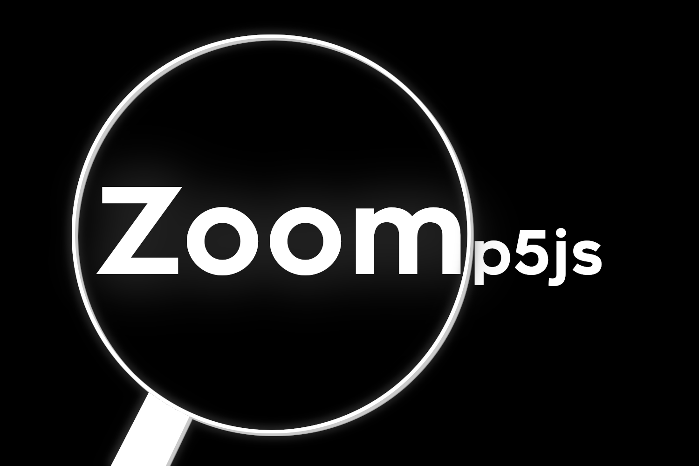

# Zoomp5js
A simple library for adding the zooming functionality to your p5.js project.



Simply create a new instance of the `Zoom` class and then apply zoom based on the location you want to zoom towards and its zoom level with the `.zoom` function. In order to apply the effects simply use `.apply`, but remember, that it will zoom using math that's heavily based upon the location of (0, 0), so unless you're going for it (no clue why you'd be doing that) I recommend that you translate it so that (0, 0) is in the center of the screen when apply the effects, or if you're in WebGL mode where that's the default, to leave it that way.

Example of how to use `.zoom`:
```js
function mouseWheel(event) {
  zoom.zoom(Vec.fromList([width, height]).divNum(2).subVec(Vec.fromList([mouseX, mouseY])), event.delta / 1000);
}
```

An example of how to use it is accessible at https://github.com/RandomGamingDev/Zoomp5js/tree/main/example and its result can be seen [here](https://randomgamingdev.github.io/Zoomp5js/example)

This library depends on the Vector implementation from https://github.com/RandomGamingDev/VecJs. To use it you can simply include https://cdn.jsdelivr.net/gh/RandomGamingDev/VecJs/vec.js in your HTML file! If you want to you can also just download the file and include it in your HTML file that way.

To use this library you can simply include https://cdn.jsdelivr.net/gh/RandomGamingDev/Zoomp5js/zoom.js in your HTML file! If you want to you can also just download the file and include it in your HTML file that way.

btw stuff updates so remember to specify a version/commit for your library if you want to use a link and don't want your code to automatically update to the newest version of the library
